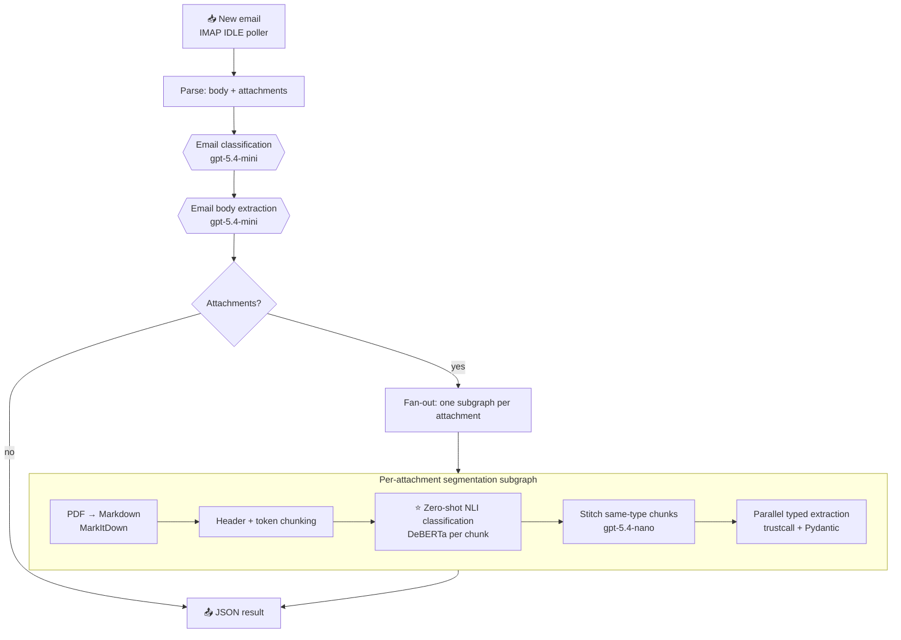

# 📨 Insurance Email Ambient Agent

> An always-on agent that reads insurance emails the moment they land, figures out what each one *is*, and pulls the structured data out of the body **and** every attachment — no human sorting required.

<p>
  
  
  
  
</p>

---

## The case study

Banks and mortgage servicers receive a relentless stream of **insurance email** — certificates of insurance, declarations pages, invoices, endorsements — attached to messages about new submissions, renewals, endorsements, and claims. Today a person opens each email, reads it, decides what it is, opens every PDF, and re-keys the policy numbers, insureds, dates, and limits into a system of record. It's slow, expensive, and error-prone at scale.

**This agent removes the manual step.** It sits on the inbox, and for every incoming email it:

1. **Classifies the email's intent** — new submission · renewal · endorsement · claim (FNOL) · *needs review*
2. **Extracts the key facts from the body** — named insured, policy number, requested effective date, requested changes, contact info
3. **Segments and reads every attachment** — even a single PDF that stacks several different documents gets split apart, each piece classified, and each piece extracted into its own typed record

The output is clean JSON, ready to drop into a downstream workflow.

---

## 🧠 The AI, and why it's interesting

This is a deliberate **hybrid pipeline** — the right model for each job, not one big LLM for everything.

### Zero-shot document classification with NLI ⭐
The heart of the attachment pipeline. Instead of training a document classifier (and needing labeled data for every new document type), each chunk of a PDF is classified **zero-shot** using a **Natural Language Inference** model — [`MoritzLaurer/deberta-v3-large-zeroshot-v2.0`](https://huggingface.co/MoritzLaurer/deberta-v3-large-zeroshot-v2.0).

NLI reframes classification as **entailment**: the document text is the *premise*, and each candidate label becomes a *hypothesis* — `"This document is a certificate of insurance"`. The model scores how strongly the text entails each hypothesis, and the top label wins. Add a new document type? Just add a string to the label list — **no retraining, no labeled data**. Low-confidence chunks (< 0.5) fall back to `needs_review` instead of guessing.

### Intelligent segment stitching
One PDF often contains several documents back-to-back. Consecutive chunks of the *same* type are compared by a tiny, cheap LLM (`gpt-5.4-nano`) that decides — from policy numbers, insured names, account numbers — whether chunk B **continues** chunk A's document or **starts a new one**. This is how a 12-page bundle becomes the correct *N* separate records.

### Schema-locked structured extraction
Every extraction is bound to a **Pydantic schema** (one per document type: certificate, invoice, declarations, endorsement) via `trustcall` + LangChain structured output. The model can only return valid, typed fields — and is instructed to leave anything not explicitly stated `null` rather than hallucinate.

### Cost-aware model routing
| Job | Model | Why |
|-----|-------|-----|
| Document classification | DeBERTa zero-shot (NLI) | Cheap, local, no labels needed |
| Segment stitching | `gpt-5.4-nano` | Tiny decision, tiny model |
| Email classification & extraction | `gpt-5.4-mini` | Needs reasoning over intent |
| PDF → Markdown (+ OCR) | MarkItDown | Robust document parsing |

---

## 🗺️ How it flows



Orchestrated with **LangGraph**: the email steps run in sequence, then a conditional edge fans out one segmentation **subgraph** per attachment (LangGraph `Send` map), each running the classify → stitch → extract pipeline in parallel and merging back via a reducer.

---

## 📂 Project layout

```
src/insurance_email_agent/
├── graph.py          # LangGraph pipeline: classification, fan-out, NLI, stitching, extraction
├── schemas.py        # Pydantic schemas & enums for every classification + extraction
├── states.py         # LangGraph state (with reducers for parallel merges)
├── prompts.py        # System / user prompts for each LLM task
├── handler/
│   ├── ingest.py     # Raw RFC822 email → typed Email (body, HTML, attachments)
│   └── runner.py     # Invokes the graph, assembles the JSON result
└── app/
    └── poller.py     # IMAP IDLE listener — the "ambient" front door
scripts/graph_smoke_test/   # Generates realistic insurance emails + PDFs and fires them at the graph
```

---

## 🚀 Run it

```bash
# install
pip install -e .          # or: uv sync

# run the graph in LangGraph Studio
langgraph dev             # serves at http://127.0.0.1:2024

# smoke-test it with generated insurance emails + PDFs
python -m scripts.graph_smoke_test --n 5 --seed 42
```

Set `OPENAI_API_KEY` (and IMAP credentials for the live poller) in `.env`. See [`scripts/graph_smoke_test/README.md`](scripts/graph_smoke_test/README.md) for the full test harness — it generates coherent, reportlab-rendered PDFs (including multi-document bundles) and checks the graph's output end-to-end.

---

## 🧰 Built with

**LangGraph** · **LangChain** · **Pydantic** · **trustcall** · **Transformers / DeBERTa (zero-shot NLI)** · **MarkItDown** · **imap-tools** · **PyTorch**
